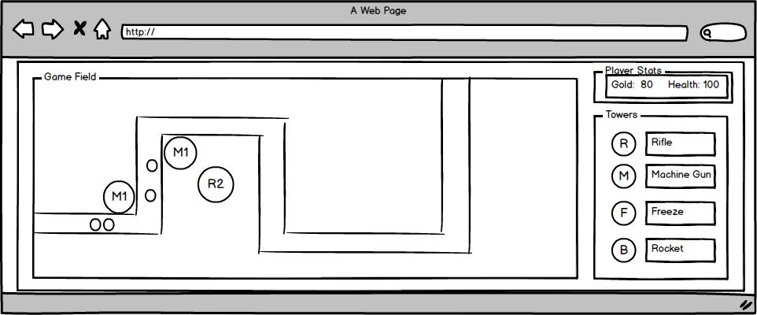

# Tower Defense

## Background

The basis for tower defense games is to prevent increasingly powerful waves of enemies from reaching the end of a field by strategically placing and upgrading towers that will attack enemies within their range.  The enemies move along a set track, spawning from one location and moving towards the other end of the track.  

Towers come in multiple types, each with a different attack type and cost to construct and upgrade.  Towers will target enemies based on their progression through the track, prioritizing the enemy within its attack radius that is the fewest movements from the goal.   

As enemies are defeated, gold will be awarded to the player which can be used to purchase new towers or upgrade existing ones.  A portion of gold spent on towers may be recovered by destroying them.  

The player has a set amount of health and each time an enemy reaches the end of the track, a portion of the player's health is taken away.  

## Functionality and MVP

- [ ] Select where to place towers within game field  
- [ ] Ability to upgrade towers  
- [ ] Ability to destroy towers  
- [ ] Enemies properly spawn in waves  
- [ ] Towers properly target enemies in the correct order

## Wireframe



## Architecture and Technologies

This project will be implemented with the following techniques:
* Vanila JavaScript and ```jquery``` for overall structure and game logic
* ```Easel.js``` with ```HTML5 Canvas``` for DOM manipulation and rendering
* Webpack to bundle and serve up various scripts

In addition to the webpack entry file, there will be multiple scripts to handle the logic behind the various classes needed to execute the game.

* ```game_view.js```: Will handle the logic for creating and updating the necessary ```Easel.js``` elements and rendering them to the DOM.
* ```game.js```: Will hold general game logic including methods to construct new towers.  Will hold the player health and gold variables.  
* ```tower.js```: Will contain the constructor method for the towers and the underlying instance methods and instance variables (type, attackPower, level, upgradeCost, refundCost)
* ```moving_object.js```: Will handle the logic for elements that will be moving (enemies and bullets)
* ```enemy.js```: Will extend ```moving_object.js```.  Will hold instance variables for each enemy including size of hit box, movementSpeed, remainingHealth, damage, and position of the enemy.
* ```bullet.js```: Will extend ```moving_object.js```.  Will hold instance variables for speed, damage, and position of the projectile.  

## Implementation Timeline

### Day 1  

*  Setup basic file structure and webpack config.
*  Get canvas rendering board.
*  Setup track array for tutorial level.
*  Write ```moving_object.js``` and ```enemy.js``` to get basic enemies smoothly moving through the field.  

### Day 2

* Build out ```tower``` class.
* Design prelim tower stats and get towers rendering.
* Install player controls for placing towers in the field.
* Begin working on ```bullet.js``` and any necessary util file to assist with stepping.  

### Day 3

* Continue working on ```bullet.js```
* Have bullets properly striking enemies by EOD.
* Setup wave generation.
* Install player controls for upgrading and destroying towers.

## Day 4

* Tune game mechanics.
* Build out main survival level track.

## Bonus Features

* Speed controller to increase game speed.
* Add additional graphics for powered up towers.
* Add additional tower and enemy types.
